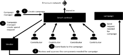

# Donaeth : An innovative crowdfunding platform utilizing blockchain technology to empower project creators and backers while enhancing transparency and trust in the fundraising process."

### Introduction ✨✨
  

According to global statistics, the world of crowdfunding using blockchain has witnessed tremendous growth, with millions of contributors actively participating in diverse projects. However, concerns about trust, security, and transparency persist. In this context, we must address the question: How can we ensure a trustworthy and decentralized crowdfunding system using blockchain technology that benefits all stakeholders involved in the fundraising process?
  
## *Current Challenges and Limitations*
  
- *Information Overload*: The world of blockchain-based crowdfunding faces a deluge of data, with a plethora of projects, contributors, and transactions in different formats and standards. These data streams are often scattered across various platforms and may present language and interoperability challenges, posing complexities in data management and analysis.

- *Cost*: Implementing and maintaining a robust blockchain-based crowdfunding platform involves substantial expenses. This includes investments in blockchain technology, smart contract development, and security measures. Additionally, there is a need to onboard and educate personnel for effective platform operation. Ongoing costs related to security, auditing, and updates further add to the financial burden.

- *Integrity and Fraud*: In the realm of blockchain-powered crowdfunding, there's a concern about data integrity and fraudulent activities. Malicious actors may attempt to manipulate or exploit the blockchain for personal gain. For instance, they could engage in fraudulent activities, misrepresent project information, or engage in deceptive practices. Ensuring the security and trustworthiness of the platform is critical.

  
## How Blockchain Technology Addresses these Issues

👉 A decentralized, peer-to-peer blockchain network fundamentally prevents unauthorized modifications or tampering with critical crowdfunding data. This immutability and transparency make it exceedingly challenging to alter records, thus preserving the integrity of the crowdfunding ecosystem.

👉 Blockchain's transparency and traceability functions, combined with smart contract automation, provide a robust defense against fraudulent activities. These features empower third-party auditors and contributors to monitor and verify transactions, enhancing trust and accountability within the crowdfunding space.


# Tools we use 🔨

## 🖼️ **FrontEnd - ReactJs**:

- **User Interface Creation**: ReactJs allows for the creation of user-friendly and responsive web pages that present crowdfunding projects, enable contributions, and offer interactive dashboards for project creators.


- **State Management**: ReactJs efficiently manages the application's state for this project. It keeps **track of real-time project funding updates, user interactions, and transaction histories**, ensuring that users have an up-to-date and smooth experience while browsing and contributing to projects.

  

- **Performance Optimization**: In ReactJs when users access the platform, they receive pre-rendered pages, which enhances page load times and contributes to better search engine optimization (SEO), improving the platform's visibility on the web.

🔩 **BackEnd - Thirdweb and Solidity

**Thirdweb**:

- **Interfacing with Blockchain**: Thirdweb serves as the bridge between the frontend and the blockchain. It facilitates secure transactions for contributors, enabling actions like donating or investing in crowdfunding projects, while also providing real-time access to blockchain data and its current state.**
  

**1. Defining Smart Contract Structures:**

- **Creating Crowdfunding Campaigns**:This template, created using Solidity, covers features such as campaign length, financing target, and project details. When a project creator initiates a new campaign, a new instance of this smart contract is deployed on the blockchain. This instance acts as a unique container for that specific campaign, ensuring that funds are raised and allocated correctly.

  
- **Managing Campaign Funds**: When backers contribute to a campaign, their contributions are held in the smart contract until the campaign ends. If the funding goal is met, the smart contract will release the funds to the project creator. If not, it returns the contributions to the backers. Solidity ensures the automated execution of these rules, eliminating the need for intermediaries and ensuring trust in the platform.
  

- **Finalizing Campaigns**: Once a crowdfunding campaign reaches its end date or funding goal, Solidity defines the conditions for finalization. If the campaign is successful, the smart contract marks it as such, allowing the project creator to access the funds for project development. If the campaign is unsuccessful, the smart contract ensures that contributors receive their contributions back. This automation streamlines the entire crowdfunding process.

  

**2. Implementing Security Measures:**
 

Solidity is also responsible for enhancing the security of the platform and preventing fraudulent activities:
 

- **Transaction Validation**: Solidity enforces strict validation rules for every transaction on the platform. It verifies that contributors meet the criteria for participating in a campaign and ensures that transactions comply with the predefined rules. This validation mechanism prevents unauthorized or malicious contributions and maintains the integrity of the crowdfunding ecosystem.
 

- **Tamper-Resistance**: Smart contracts written in Solidity are immutable once deployed. This means that once the rules are set, they cannot be altered by anyone, including the platform's administrators. This tamper-resistance prevents unauthorized changes to the crowdfunding rules, ensuring that the crowdfunding process remains fair and transparent.


## Motivation for this project 💪

  

In 2017, a group of entrepreneurs launched a crowdfunding campaign for a revolutionary new product. They raised millions of dollars from excited backers, promising to deliver the product within a year. However, things took a turn for the worse when the team realized they had underestimated the production costs and timeline. They struggled to keep up with the demand and eventually went bankrupt, leaving thousands of backers empty-handed.

  

This scenario plays out all too often in the world of crowdfunding. Project creators may have good intentions, but without proper planning, execution, and accountability, they can fail to deliver on their promises. Backers are left feeling frustrated and betrayed, and the reputation of crowdfunding platforms suffers as a result.

  

But what if there was a way to prevent such scenarios from happening? What if there was a platform that allowed backers to trustlessly fund projects, knowing that their money would only be released upon completion of specific milestones? What if project creators could prove their commitment to a project by staking their own reputation and assets on its success?

  

Enter blockchain technology. By leveraging smart contracts and a decentralized network, a crowdfunding platform built on blockchain can ensure that funds are held in escrow until project milestones are met. Backers can track progress and vote on the release of funds, ensuring that their contributions are being used effectively. Additionally, project creators can demonstrate their dedication by putting their personal assets at risk, providing an added layer of accountability.

  

With a blockchain-based crowdfunding platform, the playing field is leveled, and everyone wins. Backers get to support projects they believe in while minimizing the risk of fraud or failure. Project creators receive the necessary resources to bring their ideas to life, while also building trust and credibility within the community.

  

The potential impact of such a platform extends beyond just individual projects. By fostering a culture of transparency and accountability, blockchain-powered crowdfunding can help restore trust in the crowdfunding industry as a whole. With fewer instances of failed projects and unhappy backers, more people will feel confident in supporting innovative ideas and startups, ultimately driving economic growth and technological advancement.

  

Now imagine a future where every crowdfunding platform operates on blockchain principles. The possibilities are endless – a world where anyone can turn their vision into reality, regardless of their background or connections. A world where the next generation of game-changing products and services emerge from the grassroots level, thanks to the collective efforts of passionate individuals from all corners of the globe.

## Explanation of Solidity Code <a name="sol"/>

```solidity
contract YourContractName {
    struct Campaign {
        address owner;
        string title;
        string description;
        uint256 target;
        uint256 deadline;
        uint256 amountCollected;
        string image;
        address[] donators;
        uint256[] donations;
    }

    Campaign[] public campaigns;
    uint256 public numberOfCampaigns;

    function createCampaign(address _owner, string memory _title, string memory _description, uint256 _target, uint256 _deadline, string memory _image) public returns (uint256) {
        Campaign storage campaign = campaigns[numberOfCampaigns];

        // Test to see if everything is ok
        require(campaign.deadline < block.timestamp, "The deadline should be a date in the future.");

        campaign.owner = _owner;
        campaign.title = _title;
        campaign.description = _description;
        campaign.target = _target;
        campaign.deadline = _deadline;
        campaign.amountCollected = 0;
        campaign.image = _image;

        numberOfCampaigns++;

        return numberOfCampaigns - 1; // Index of the created Campaign
    }

    function donateToCampaign(uint256 _id) public payable {
        uint256 amount = msg.value;

        Campaign storage campaign = campaigns[_id];

        campaign.donators.push(msg.sender);
        campaign.donations.push(amount);

        (bool sent,) = payable(campaign.owner).call{value : amount}(""); // Payable requires 2 args

        if (sent) {
            campaign.amountCollected = campaign.amountCollected + amount;
        }
    } // Get the ID of the user who donates

    function getDonators(uint256 _id) view public returns (address[] memory, uint256[] memory) { // To see who donated
        Campaign storage campaign = campaigns[_id];
        return (campaign.donators, campaign.donations);
    } // To see who donated

    function getCampaigns() public view returns (Campaign[] memory) {
        Campaign[] memory _campaigns = new Campaign[](numberOfCampaigns); // Creating a new variable to store the campaigns; basically a copy of the campaigns array but the values inside the created array are empty

        for (uint256 i = 0; i < numberOfCampaigns; i++) { // Storing the values of the campaigns array into the _campaigns array
            Campaign storage campaign = campaigns[i];
            _campaigns[i] = campaign;
        }

        return _campaigns;
    }
}
```
### Explanation  :

#### `createCampaign`:
- **Purpose**: This function is used to create a new campaign within the crowdfunding platform.
- **Parameters**:
  - `_owner`: Address of the campaign owner.
  - `_title`: Title of the campaign.
  - `_description`: Description of the campaign.
  - `_target`: Target amount to be raised in the campaign.
  - `_deadline`: Deadline or end date for the campaign.
  - `_image`: Image related to the campaign (potentially a URL or reference to an image).
- **Functionality**:
  - Checks if the deadline specified for the campaign is in the future.
  - If the conditions are met, it creates a new campaign with the provided details and returns the index of the created campaign.

#### `donateToCampaign`:
- **Purpose**: Allows users to donate to a specific campaign.
- **Parameters**:
  - `_id`: ID of the campaign to which the donation is made.
- **Functionality**:
  - Receives the donation amount sent with the transaction.
  - Adds the sender's address and the donation amount to the specified campaign's records.
  - Transfers the donation amount directly to the campaign owner and updates the total amount collected if the transfer is successful.

#### `getDonators`:
- **Purpose**: Retrieves information about the donors to a particular campaign.
- **Parameters**:
  - `_id`: ID of the campaign for which donor information is requested.
- **Functionality**:
  - Returns two arrays: one containing the addresses of the donors (`donators`) and the other containing the amounts donated (`donations`) to the specified campaign.

#### `getCampaigns`:
- **Purpose**: Fetches all the campaigns created within the platform.
- **Functionality**:
  - Creates a new array (`_campaigns`) to store information about the campaigns.
  - Iterates through the existing campaigns, populating the `_campaigns` array with details about each campaign.
  - Returns an array with details of all the campaigns created, allowing users to view information about multiple campaigns.  

### Literature Survey 📄<a name="lit"/>

|Sl.no|Title|Description|How this survey will be used for the project|
|---|---|---|---|
|1.|Crowdfunding Using Blockchain Technology<br><br>[https://ijirt.org/master/publishedpaper/IJIRT158590_PAPER.pdf](https://ijirt.org/master/publishedpaper/IJIRT158590_PAPER.pdf)|- Crowdfunding is a new financial system that is innovative yet disruptive.<br><br>- It is a low-cost way of accessing capital, which increases the potential audience for ideas and ventures.<br><br>- Crowdfunding represents an alternative way of funding compared to traditional borrowing.|This paper will be used to understand the basics of crowdfunding and how it differs from traditional borrowing. It will also provide insights into the potential audience for ideas and ventures.|
|2.|Blockchain based crowdfunding systems<br><br>[https://papers.ssrn.com/sol3/papers.cfm?abstract_id=4330476](https://papers.ssrn.com/sol3/papers.cfm?abstract_id=4330476)|- The paper discusses a decentralized app in the Ethereum blockchain to optimize the crowdfunding process.<br><br>- The app is designed to provide a platform for entrepreneurs to raise funds and for investors to invest in projects that interest them.|This paper will be used to understand the technical aspects of blockchain-based crowdfunding platforms and how they can be optimized for project creators and backers.|
|3.|Blockchain-Based Crowdfunding Application<br><br>[https://www.mdpi.com/2076-3387/13/6/144](https://www.mdpi.com/2076-3387/13/6/144)|- The crowdfunding application is designed to give assurance to investors.<br><br>- The platform is not just like any other application that allows people to invest their money|This paper will be used to understand how blockchain technology can enhance transparency and trust in the fundraising process. It will also provide insights into how the platform can be designed to give assurance to investors.|
|4.|Crowdsource funding solution based on blockchain tokens<br><br>[https://www.ncbi.nlm.nih.gov/pmc/articles/PMC9651591/](https://www.ncbi.nlm.nih.gov/pmc/articles/PMC9651591/)|- The paper proposes a blockchain-based crowdfunding platform that can help decentralize the funding model from companies like Kickstarter.<br><br>- The application replaces intermediaries such as Kickstarter to provide a platform for entrepreneurs to raise funds and for investors to invest in projects that interest them.|This paper will be used to understand how blockchain technology can help decentralize the funding model and how intermediaries such as Kickstarter can be replaced.|
|5.|Evaluation of Blockchain-Based Crowdfunding Campaign Success Factors Based on VASMA-L Criteria Weighting Method<br><br>[https://opengeekslab.com/blog/blockchain-technology-in-crowdfunding/](https://opengeekslab.com/blog/blockchain-technology-in-crowdfunding/)|- The paper evaluates blockchain-based crowdfunding campaign success factors based on VASMA-L criteria weighting method.<br><br>- The paper discusses the success determinants of initial coin offerings.|This paper will be used to understand the success factors of blockchain-based crowdfunding campaigns and how they can be evaluated.|
|6.|Crowd Funding Platform Using Blockchain<br><br>[https://ieeexplore.ieee.org/document/9640888](https://ieeexplore.ieee.org/document/9640888)|- The paper proposes a blockchain-based crowdfunding platform to address the limitations of existing crowdfunding platforms.<br><br>- The platform is designed to provide a platform where all campaign details, donations, withdrawals, and funds are stored on an open blockchain network that is accessible to everyone.|This paper will be used to understand the limitations of existing crowdfunding platforms and how blockchain technology can address them. It will also provide insights into how the platform can be designed to enhance transparency and accessibility.|
|7.|Crowdfunding Using Blockchain Technology<br><br>[https://stackoverflow.com/questions/2149854/how-to-manually-equalize-columns-in-an-ieee-paper-if-using-bibtex](https://stackoverflow.com/questions/2149854/how-to-manually-equalize-columns-in-an-ieee-paper-if-using-bibtex)|- Crowdfunding is a new financial system that is innovative yet disruptive.<br><br>- It is a low-cost way of accessing capital, which increases the potential audience for ideas and ventures.<br><br>- Crowdfunding represents an alternative way of funding compared to traditional borrowing.|This paper will be used to understand the basics of crowdfunding and how it differs from traditional borrowing. It will also provide insights into the potential audience for ideas and ventures.|
|8.|Blockchain based crowdfunding systems<br><br>[https://tex.stackexchange.com/questions/356520/split-long-algorithm-over-multiple-columns-in-a-springer-paper](https://tex.stackexchange.com/questions/356520/split-long-algorithm-over-multiple-columns-in-a-springer-paper)|- The paper discusses a decentralized app in the Ethereum blockchain to optimize the crowdfunding process.<br><br>- The app is designed to provide a platform for entrepreneurs to raise funds and for investors to invest in projects that interest them.|This paper will be used to understand the technical aspects of blockchain-based crowdfunding platforms and how they can be optimized for project creators and backers.|
|9.|Evaluation of Blockchain-Based Crowdfunding Campaign Success Factors Based on VASMA-L Criteria Weighting Method<br><br>[https://ieeecss.org/publication/transactions-automatic-control](https://ieeecss.org/publication/transactions-automatic-control)|- The paper evaluates blockchain-based crowdfunding campaign success factors based on VASMA-L criteria weighting method.<br><br>- The paper discusses the success determinants of initial coin offerings.|This paper will be used to understand the success factors of blockchain-based crowdfunding campaigns and how they can be evaluated.|
|10.|Crowd Funding Platform Using Blockchain<br><br>[https://ieeexplore.ieee.org/document/9640888](https://ieeexplore.ieee.org/document/9640888)|- The paper proposes a blockchain-based crowdfunding platform to address the limitations of existing crowdfunding platforms.<br><br>- The platform is designed to provide a platform where all campaign details, donations, withdrawals, and funds are stored on an open blockchain network that is accessible to everyone|This paper will be used to understand the limitations of existing crowdfunding platforms and how blockchain technology can address them. It will also provide insights into how the platform can be designed to enhance transparency and accessibility.|

## Teammates Roles <a name="team"/>

### Front End 🎨 ( ReactJs)  
### 1. Vignesh M (Front End Developer)  

As a front end developer, Vignesh's primary responsibility is to create a user-friendly and visually appealing interface for the crowdfunding platform. They will be working with React.js, a popular JavaScript library for building user interfaces, and Tailwind CSS, a utility-first CSS framework that allows developers to write cleaner and more modular code.

Vignesh's role involves designing and implementing the layout, colors, typography, and visual elements of the platform. They will also ensure that the interface is responsive, accessible, and works seamlessly across different devices and browsers. To achieve this, Vignesh will work closely with the backend developers to integrate the front end with the backend functionality, ensuring a smooth user experience.


Some of the key tasks that Vignesh will perform include:

* Designing wireframes and mockups of the platform's UI
* Writing clean and efficient React.js code
* Creating reusable components and modules
* Integrating third-party libraries and APIs
* Optimizing the front end for performance and accessibility
* Collaborating with the backend developers to ensure seamless integration

  
#### 2. Joseph John Philip and Sriram G (Blockchain Developer)

As a blockchain developer, Joseph's and Sriram's primary responsibility is to build and deploy smart contracts on the Ethereum blockchain that will power the crowdfunding platform. He will work closely with Sriram to ensure that the smart contracts interact seamlessly with the backend and front end.

Joseph's role involves writing, testing, and deploying smart contracts that govern the rules and logic of the crowdfunding platform. They will use Solidity, a high-level programming language for developing smart contracts, to create these contracts. Joseph will also ensure that the smart contracts are secure, auditable, and transparent, and that they adhere to best practices for blockchain development.
  
Some of the key tasks that Joseph and Sriram will perform include:

* Researching and analyzing existing crowdfunding platforms on blockchain
* Designing and developing smart contracts for various features of the platform
* Testing and debugging smart contracts using Truffle Suite and other tools
* Deploying smart contracts on the Ethereum testnet and mainnet
* Collaborating with Sriram to integrate smart contracts with the backend
* Documenting and sharing knowledge with the team about blockchain development best practices


## Workflow image showing the process of crowdfunding platform <a name="workflow"/>



## Features of this project<a name="features"/>

- **Create Campaigns**: Users can easily create campaigns and provide detailed descriptions about their projects, including goals, deadlines, and any additional information they deem necessary.
    
- **Secure and Transparent**: Leveraging the power of Web3 technology, this application ensures security and transparency throughout the entire crowdfunding process. All transactions are securely stored on the blockchain, providing an immutable record of donations.
    
- **Connect with Wallets**: Users can connect their Web3 wallets, such as MetaMask, to seamlessly interact with the application and make donations. This simplifies the funding process and ensures a smooth user experience.
    
- **Real-Time Updates**: The application provides real-time updates on the progress of each campaign, including the total funds raised and the number of supporters. This allows users to track the success of their projects and keep the community engaged.
    
- **Developer Earnings**: As the developer of this crowdfunding app, you receive a 2% fee from each donation made to the campaigns. This incentivizes you to continue maintaining and improving the application while supporting the growth of the crowdfunding community.

# Requirements for the Site <a name="req" />

### Dashboard Page Actions 🏠

  
The dashboard page serves as the central hub for all user activity on the platform. From here, users can perform various actions related to their campaigns, such as creating a new campaign, viewing existing campaigns, and managing their contributions.

  
To create a new campaign, users can click on the "Create Campaign" button, which will take them to a form where they can specify details such as the campaign name, description, target amount, and deadline. Users can also choose to add a custom image or video to showcase their campaign.

  
Once the campaign is created, it will appear on the dashboard page, along with information such as the current amount raised, number of backers, and remaining days until the deadline.

### Campaign Page 📢

When users click on a specific campaign from the dashboard page, they are taken to the campaign page, which provides detailed information about the campaign. Here, users can find information such as the campaign goal, progress bar, and number of backers. There may also be a section for comments or updates from the campaign creator.

One important feature of the campaign page is the ability for users to contribute to the campaign. Users can enter the amount they want to contribute, select a payment method (such as MetaMask), and confirm their transaction. Once the transaction is confirmed, the user's contribution will be added to the total amount raised, and they will receive a receipt for their contribution.

All of these options are solely determined by the role of the individual who has signed in.

A separate branch has been created on the repository to facilitate project flow management.

  
| Branch | Description |

| ------- | --------- |

| Main | Only the stable version of code are updated to the main branch |

| Vignesh | Finishes and Completes the frontend code for the project (eg. Login page and Landing Page ) |

| Sriram | Codes the backend required for storing the data about the user. Quickly works on the backend begins as soon as the login page frontend finishes in the "vignesh" branch. In the meantime rest of the front end is refined in vignesh branch |

| Joseph (Team Leader)|  Solely works on blockchain development using Thirdweb. Refines frontend and backend to maximize stability of the project  |

  
  

## [Reference Paper Link 1 : Crowdfunding Platform Using Blockchain Technology](https://ijirt.org/master/publishedpaper/IJIRT155716_PAPER.pdf)

## [Research Paper Link 2 :Evaluation of Blockchain-Based Crowdfunding Campaign Success Factors Based on VASMA-L Criteria Weighting Method ](https://www.mdpi.com/2076-3387/13/6/144)

## [Research Paper Link 3 : Crowdfunding Using Blockchain Technology ](https://papers.ssrn.com/sol3/papers.cfm?abstract_id=4330476)

## [Article Link 1 :STO based crowdfunding platform for technology startups ](https://unicsoft.com/portfolio/sto-based-crowdfunding-platform-for-technology-startups)

## [Article  Link 2 : Benefits of Blockchain Powered Crowdfunding ](https://articles.abilogic.com/378455/benefits-blockchain-powered-crowdfunding-real.html)

## [Research Paper Link 4 :Blockchain-Based Crowdfunding Application ](https://ieeexplore.ieee.org/document/9640888)

## [Research Paper Link 5 : Blockchain crowdfunding systems](https://www.semanticscholar.org/paper/Blockchain-based-crowdfunding-systems-Saadat-Halim/f9e070e981f30907e15556fc7959f5aeb7eeb969)
## [Research Paper Link 6 : The role of blockchain technology-based social crowdfunding in advancing social value creation](https://www.sciencedirect.com/science/article/abs/pii/S0040162521003309)

## [Research Paper Link 7 : The Application of Blockchain Technology in Crowdfunding: Towards Financial Inclusion via Technology](https://www.ceeol.com/search/article-detail?id=706962)

## [Research Paper Link 8 : Venturing Crowdfunding using Smart Contracts in Blockchain](https://ieeexplore.ieee.org/abstract/document/9214295)

## [Research Paper Link 9 :A Framework for Crowdfunding Platform Using Ethereum Blockchain Technology](https://link.springer.com/chapter/10.1007/978-981-16-8012-0_9)
